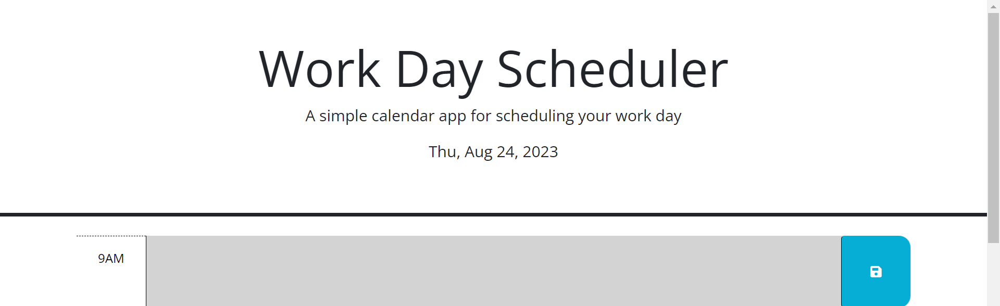
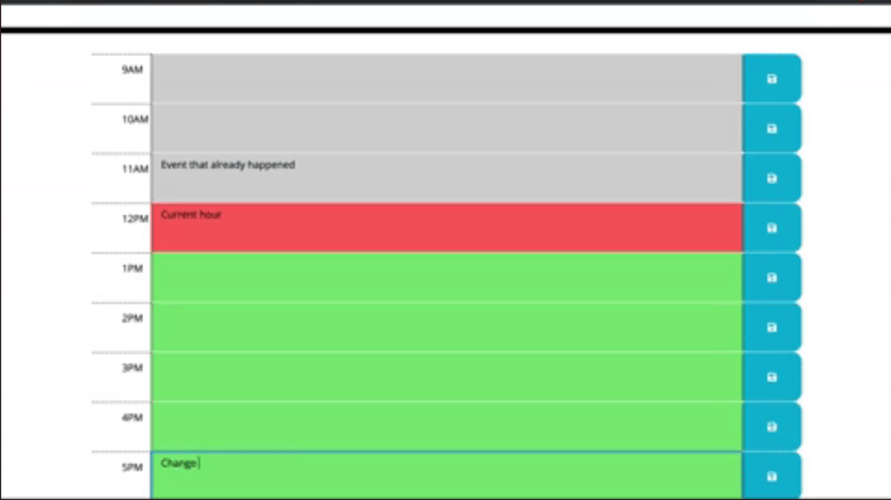

# challenge_5-Work_Day_Scheduler

## Description 
This is a simple calendar application that allows a user to save events for each hour of a typical working day (9am to 5pm). This app will run in the browser and feature dynamically updated HTML and CSS powered by jQuery.

 ## Table of contents.
     1. head contains title and date of the day.
     2. slot for each hour with a text area to input events.
     3. save button for each slot to store events.

 ### page:
 when the user runs the page it will show 8 slots for working day hours from 9am to 5pm.
 each slot will have input text area next to the time with different color depending on the time of the day.
 save button to help user be able to save events put in each slot. 
 

 ## Usage.
  once the user runs the app it will show time slots in 3 different colors each color represents different state,
  green color represents future time,
  red color represents present time,
  grey color represents past time.
  next to each hour displayed there will be an input text area allows user to type in events and a save button to store those events localy on device used,
  once the save button is clicked data entered will be saved and viewable every time user runs the page until removed and save button is clicked again.
 ## Screenshots.

### Deployed Page Link:
 https://nabil1294.github.io/Work_Day_Scheduler/

## Credits.

dom traversal 
https://www.w3schools.com/jquery/jquery_traversing.asp

parent id
https://stackoverflow.com/questions/10260667/jquery-get-parent-parent-id#:~:text=%24(this).-,parent().,id%20of%20the%20parent's%20parent.

setting local storage
https://stackoverflow.com/questions/40791207/setting-and-getting-localstorage-with-jquery

day.js
https://day.js.org/docs/en/display/format

local storage getting value
https://www.w3schools.com/jsref/met_storage_getitem.asp

